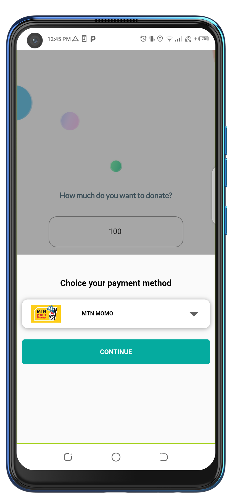
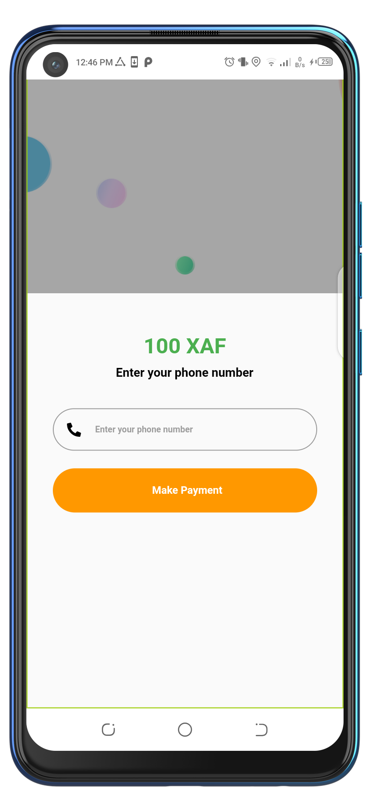

# PayUnitDemo

A sample flutter app build to demonstrate how to integrate PayUnit sdk in your app with simple steps.

## Getting Started

#### Create your account on [payunitnet.net](https://pub.dev/packages/pay_unit_sdk/install) and get your credentails


#### Head over to [pub.dev](https://pub.dev/packages/pay_unit_sdk/install) and add the payunit sdk dependency


```

dependencies:
  pay_unit_sdk: ^2.0.3

```
```
import 'package:pay_unit_sdk/pay_unit_sdk.dart';
```

#### Add your repository in the build.grade file


```

allprojects {
    repositories {
        google()
        mavenCentral() 
        jcenter()
    }
}
```

#### Add the PayUnit button where ever you need to do your transaction and add your credentials as well.
```
PayUnitButton(
              apiUser:"<Your apiuser>",
              apiPassword:  "<Your apiPassword>",
              apiKey: "<Your apiKey>",
              transactionId: "<The id of your transaction and should be less less than 20 character>",
              mode: 'sandbox' // sandbox or live,
              transactionCallBackUrl:"<Your transactionCallBackUrl url>",
              notiFyUrl: "<Your notification url>",
              transactionAmount:  "<Your transaction amount>",
              currency:"XAF", //// The currency of your transaction : XAF for FCFA or USD for $ ect ...
              buttonTextColor:  "<Custom the color of the text PayUnit button>",
              productName:"<The name of the product>",
              color: "<Custom the color of PayUnit button>",///the colors Button text DEFAULT WHITE,
              actionAfterProccess: (transactionId, transactionStatus) {
               //here is the action who start after the end of the paiement , you can perform 	
               //some operation here , like display a alertDialog after the end of the payment.
              },
            ),


```




